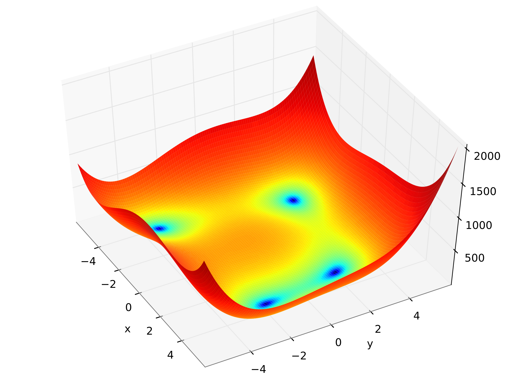
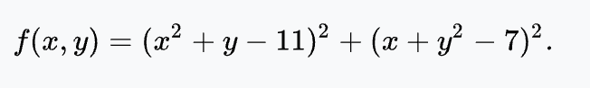
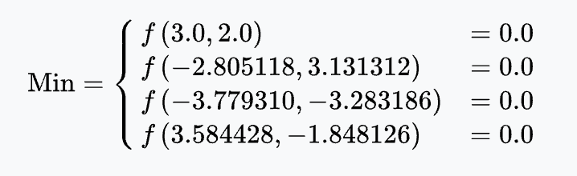

## 3D Metaheuristics in Python
The implemented 3D metaheuristics are:

* Random Search (RS),
* Simple Descent (SD),
* Deepest Descent (DS),
* Multistart Descent (MD),
* Tabu Search (TS),
* Simulated Annealing (SA),
* Threshold Accept (TA).

All of the implemented algorithms can be used to find the minimum of 3D function.  
For example : <p align="center">Himmelblau_function</p>
<p align="center">

</p>
<p align="center">

</p>
<p align="center">

</p>

### Requirement
```
python==3.7.0
numpy==1.18.1
```
### How to use
Open test.py you will find some examples
```
import src.mt as meta
import numpy as np

def himmelblau(x,y):
    a = (x**2+y-11)**2+(x+y**2-7)**2
    return a

mt = meta.MT(f=himmelblau,n=1000,x0=4,y0=7,a=10,T=100,verbose=False)

x,y = mt.random_search(-100,100)
print("x=",round(x,5),"\t","y=",round(y,5),"\t","f(x,y)=",round(himmelblau(x,y),5))
```
#### Result
```
Random Search
x = 3.36113 	  y = 3.0865 	   f(x,y) = 46.11334


Simple Descent
x = 3.52091 	  y = -1.59771 	 f(x,y) = 0.89862


Deepest Descent
x = 3.59936   	  y = -1.86037 f(x,y) = 0.01267


Multistart Descent
x = -2.77636 	  y = 3.12107 	 f(x,y) = 0.03041


Tabu Search
x = 2.54073 	  y = 2.54073 	 f(x,y) = 8.00003


Simulated Annealing
x = -2.88875 	  y = 3.15219 	 f(x,y) = 0.24931


Threshold Accept
x = 3.68223 	  y = -2.05492   f(x,y) = 1.07281
```
### More information
[Random_Search](https://en.wikipedia.org/wiki/Random_search)   
[Simple_Descent](https://en.wikipedia.org/wiki/Random_search)   
[Deepest_Descent](https://en.wikipedia.org/wiki/Random_search)   
[Multistart_Descent](https://en.wikipedia.org/wiki/Random_search)   
[Tabu_Search](https://en.wikipedia.org/wiki/Tabu_search)
